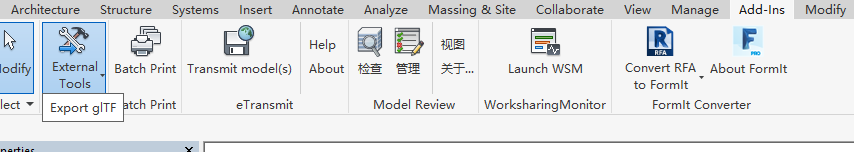

# RevitGltfExporter

RevitGltfExporter is a revit add-in for exporting model to glTF format. Built and test at Revit 2018

## Usage

Follow below steps to install add in:

1. Clone this repository and build it.
2. Copy the release folder to the Revit add-in folder and rename it to "GltfExporter" or whatever you like. It should be "C:\ProgramData\Autodesk\Revit\Addins\2018\GltfExporter\RevitGltfExporter.dll".
3. Copy the GltfExporter.addin to above revit add-in folder. Open as text file and edit the assembly path accordingly.
4. Open your rvt model in Revit.
5. Find the "Export glTF" menu as below screen shot.

